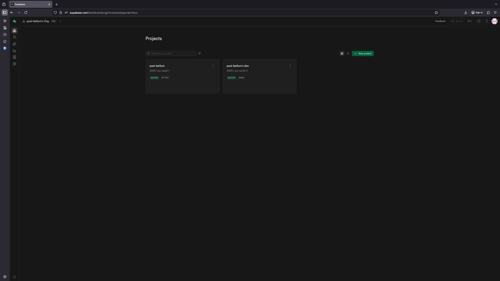
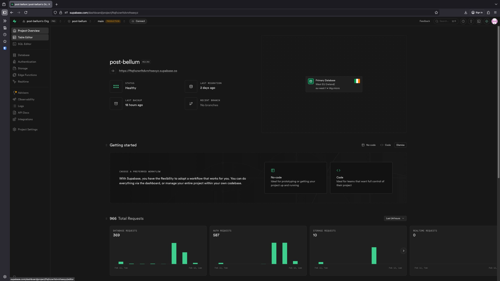
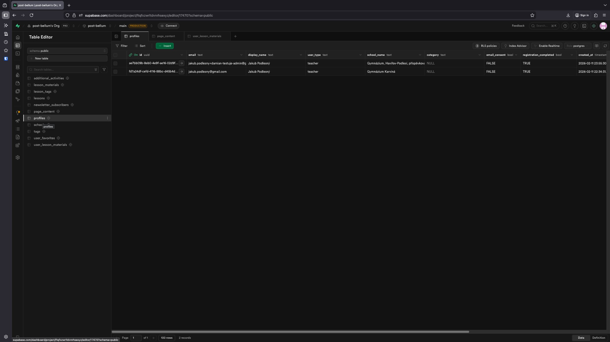
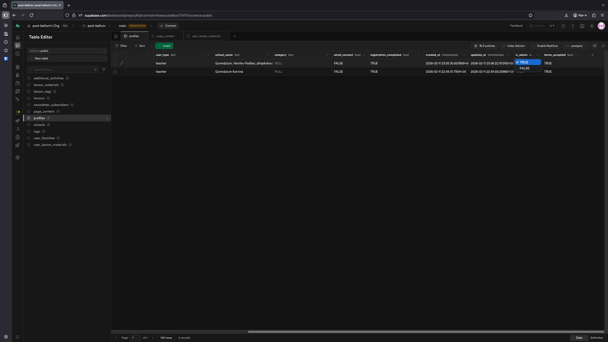

# Jak udělit uživateli administrátorská práva

Tento návod popisuje, jak nastavit uživatele jako administrátora v databázi projektu Post Bellum přes Supabase dashboard.

---

## Postup

### 1. Otevřete projekt Post Bellum

Na stránce projektů v Supabase dashboardu klikněte na dlaždici **post-bellum**.

> 💡 Pokud vidíte více projektů, hledejte ten s označením „post-bellum“ (nikoli „post-bellum's dev“).

### 2. Otevřete Table Editor

V levém postranním panelu klikněte na **Table Editor** (ikona tabulky).

### 3. Vyberte tabulku profiles

V seznamu tabulek pod „schema public“ zvolte tabulku **profiles**.

### 4. Najděte uživatele

V tabulce vyhledejte řádek požadovaného uživatele podle sloupce **email** nebo **display_name**.

### 5. Změňte sloupec `is_admin`

- Najděte sloupec **is_admin**
- Dvakrát klikněte na buňku u daného uživatele
- Z rozbalovací nabídky vyberte **TRUE**

Změna se po výběru uloží automaticky.

---

## Shrnutí

| Krok | Akce |
|------|------|
| 1 | Kliknout na dlaždici **post-bellum** |
| 2 | V levém menu vybrat **Table Editor** |
| 3 | Vybrat tabulku **profiles** |
| 4 | Najít uživatele podle emailu nebo jména |
| 5 | Dvojklikem na sloupec **is_admin** nastavit hodnotu na **TRUE** |

---

## Zrušení administrátorských práv

Pro odebrání administrátorských práv postupujte stejně, ale v kroku 5 vyberte hodnotu **FALSE** místo **TRUE**.
